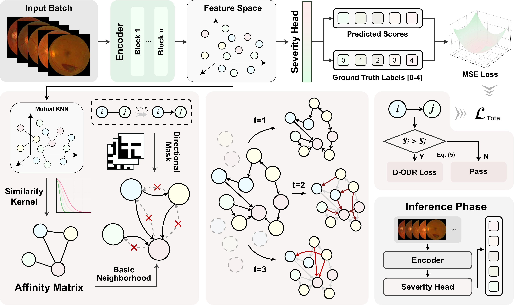

# D-ODR: Directed Ordinal Diffusion Regularization for Progression-Aware Diabetic Retinopathy Grading

**D**irected **O**rdinal **D**iffusion **R**egularization (**D-ODR**) enables progression-aware Diabetic Retinopathy (DR) grading by respecting the continuous, irreversible nature of the disease. Moving beyond traditional symmetric ranking, it leverages a progression-constrained directed graph and multi-scale diffusion to penalize biologically implausible reverse transitions, strictly aligning the learned feature space with the natural trajectory of disease worsening.

<p align="center">
  
</p>

## 🌟 Highlights

- **Progression-Aware Reasoning**: Explicitly models the irreversible and continuous severity stages of Diabetic Retinopathy rather than relying on standard symmetric ordinal regression.
- **Zero Inference Overhead**: The D-ODR module is used solely for structured regularization during the training phase, preserving standard $O(1)$ inference complexity with no extra computational cost.
- **Plug-and-Play**: Seamlessly integrates with both general vision transformers (e.g., `ViT-B/16`) and medical domain-specific foundational models (e.g., `RETFound`), yielding state-of-the-art results.

## 🛠️ Installation

1. **Clone the repository**

   ```bash
   git clone https://github.com/HovChen/D-ODR.git
   cd D-ODR
   ```

2. **Install dependencies**

   ```bash
   conda create -n DODR python=3.11
   pip install -r requirements.txt
   ```

## 🚀 Quick Start

We provide scripts for easy model training and evaluation using the GDRBench protocol.

### Training

You can easily start training using the provided shell script `scripts/train.sh` or by running the python script directly.

**Using Shell Script:** Edit `scripts/train.sh` to point to your specific data paths (`dataset_root` and `splits_root`), then run:

```bash
bash scripts/train.sh
```

**Using Python Command:**

```bash
CUDA_VISIBLE_DEVICES=0,1,2,3 python3 scripts/train.py \
    --dataset "APTOS" \
    --dataset_root "/path/to/GDRBench/images" \
    --splits_root "/path/to/GDRBench/splits" \
    --backbone "vit_base_patch16_224" \
    --batch_size 128 \
    --epochs 100 \
    --lr 1e-4 \
    --lambda_odr 1.0 \
    --kernel_k 25 \
    --save_dir "./checkpoints"
```

**Key Arguments:**

- `--dataset`: Target dataset (`APTOS`, `Messidor`, `DeepDR`, or `DDR`).
- `--backbone`: The vision backbone to use (`vit_base_patch16_224` or `retfound`).
- `--lambda_odr`: The weight factor for the D-ODR Loss (default: `1.0`).
- `--kernel_k`: The `k` value used for constructing the Mutual KNN graph (default: `25`).
- `--batch_size`: Training batch size (default: `128`).

## 📂 Datasets

This project evaluates on four public DR datasets formatted via the **[GDRBench](https://github.com/chehx/DGDR/blob/main/GDRBench/README.md)** protocol:

- **APTOS**
- **Messidor**
- **DeepDR**
- **DDR**

Please ensure your `dataset_root` contains the images and `splits_root` contains the standard split `.txt` files.

## 📜 License

This project is licensed under the [Apache License 2.0](https://www.apache.org/licenses/LICENSE-2.0).

## 🤝 Acknowledgment

Our project is developed based on the following repositories and foundational models:

- [RETFound](https://github.com/rmaphoh/RETFound)
- [GDRBench](https://github.com/chehx/DGDR/blob/main/GDRBench/README.md)

